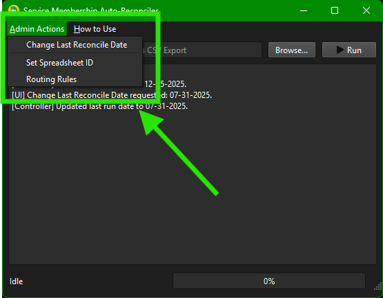
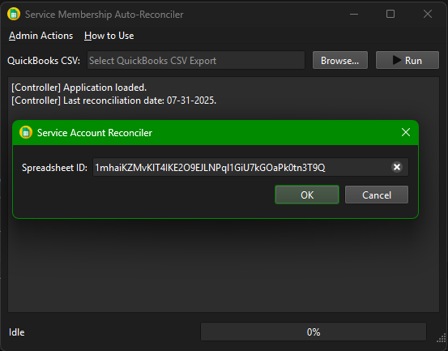
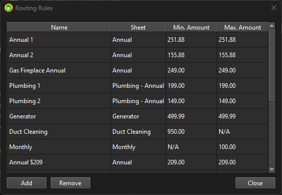

# Administrator Operation

## Introduction

The administrator features of the CM Heating Service Account Reconciler provide advanced 
users with the ability to manage and maintain the application's database and settings. 
This guide will walk you through the various administrative functions available within 
the application.

## Accessing Admin Features

Administrator features can be accessed through the main toolbar at the top of the 
application's main window.

The three available functions are:

- **`Change Last Reconcile Date`**: Allows you to update the last reconciliation date stored in the database.
- **`Set Spreadsheet ID`**: Enables you to change the Google Sheets spreadsheet ID used by the application.
- **`Routing Rules`**: Opens the routing rules management interface, where you can add, edit, or delete rules
  that dictate how service accounts are processed during reconciliation.

Each of these functions is detailed in the sections below.

## Change Last Reconcile Date

!!! Warning "Important"
    Changing the last reconcile date can have significant implications on the reconciliation process.
    Ensure that you understand the consequences of changing this date before proceeding.

Clicking the "Change Last Reconcile Date" button will open a dialog that allows you to
update the last reconciliation date stored in the database.

Upon selecting the option in the 'Admin Actions' menu, a date picker dialog will appear:

From here select the desired date and click "OK" to update the database. The application will confirm
the change in the log panel.

## Set Spreadsheet ID

!!! Danger "Caution"
    This will typically never need to be changed except in very rare circumstances. Please 
    consult Accounting Management before modifying this setting.

??? Info "Modifying Spreadsheet ID"
    The "Set Spreadsheet ID" button allows you to change the Google Sheets spreadsheet ID
    that the application uses to access the service account data.
    
    Clicking this button will open a dialog where you can enter the new spreadsheet ID:
    
    
    
    This dialog displays the current spreadsheet ID and will accept a full Google Sheets
    URL or just the spreadsheet ID itself to update the value. After entering the new ID, 
    click "OK" to save the change. The application will confirm the update in the log panel.

## Routing Rules

!!! Danger "Caution"
    Modifying routing rules can significantly affect how service accounts are processed
    during reconciliation. Ensure that you understand the implications of any changes
    before applying them.

Routing rules determine how service accounts are categorized and processed during
the reconciliation process. Each routing rule has a name, a maximum  and minimum
value, and a destination sheet name. These rules help the application decide where
to route each service account record based on its balance.

Clicking the "Routing Rules" button will open the routing rules management interface:

In the above example, you can see a list of existing routing rules. You can add or delete 
rules using the buttons at the bottom of the interface, and editing a rule's details can 
be done directly within the table.

### Adding a Routing Rule

To add a new routing rule, click the "Add" button. This will create a new row in the table
where you can enter the details for the new rule:

Fill in the name of your new rule, select the sheet a matching record should be routed to, and
enter the minimum and maximum amount fields as appropriate. An unbounded value (i.e., no minimum or maximum)
can be indicated by leaving the respective field blank.

??? Abstract "Unbounded Values: Example"
    You would like to create a rule that applies to all amounts greater than $1000 and routes to
    the Duct Cleaning sheet. You would enter "$1000" for the "Min. Amount" field, leave 
    "Max. Amount" blank, and set the sheet to "Duct Cleaning".

    

You can add as many rules as needed during a single session, and upon clicking "Close", all changes
will be saved to the database.

### Editing a Routing Rule

To edit an existing routing rule, simply click on the desired cell within the table and modify
its contents. You can change the "Name" to any descriptive textual value, the "Amount" fields to
any valid decimal number (or leave them blank for unbounded), and the "Sheet" to any valid sheet name
from the dropdown box provided.

Changes are saved automatically when you click "Close" to exit the dialog.

### Removing a Routing Rule

To remove an existing routing rule, select the desired rule from the list and click the "Remove"
button. The rule will be deleted from both the list and the database.
