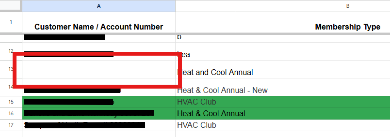

# Error Details

## Introduction

The CM Heating Service Account Reconciler is designed to handle various errors that may 
arise during the reconciliation process. This section outlines the six errors that
may result from issues with data integrity. Any other errors will be noted in the log panel, 
and should be [directed to the developer](mailto:stephanie@frogge.tech) for further investigation.

## Name Missing Error

This error occurs when a service account name/account number combination is fully missing 
from the name column of the Google Sheets record. 

The reconciler is unable to process this record as it cannot identify which account the data
belongs to.

??? Abstract "Example"
    A record that triggers this error will typically look like the following:
    
    

## Name Parse Error

This error occurs when the service account number in the Google Sheets record is missing.
This may be due to formatting issues or a missing account number value.

The reconciler is unable to process this record as it cannot accurately identify the
account.

??? Abstract "Example"
    A record that triggers this error will typically look like the following:
    
    

    Please note that the name is present in the above example, but the account number is missing.

## Numeric Parse Error

This error occurs when the amount field in a Google Sheets record cannot be parsed as a valid
decimal number. This may be due to formatting issues, such as the presence of non-numeric
characters or an empty value.

The reconciler is unable to process this record as it cannot accurately interpret the
amount value.

??? Abstract "Example"
    A record that triggers this error will typically look like the following:

    

## QuickBooks Parsing Error

This error occurs when a record within the QuickBooks CSV record's name field cannot be parsed correctly.

The reconciler is unable to process this record as it cannot accurately identify the account.

??? Abstract "Example"
    A record that triggers this error will typically look like the following:

    

## No Records to Reconcile Error

This error occurs when there are no valid positive balance records (on any sheet) to reconcile a given 
QuickBooks item against. Typically, this indicates a problem on accounting's side of things. 

The error reports the QuickBooks item row that triggered the issue, which is the best place to start
investigating the problem.

??? Abstract "Investigation Tip"
    To investigate this error, start by checking the QuickBooks item amount and then look for
    any Google Sheets records with matching account IDs. If none of the amounts match, this
    indicates a discrepancy that needs to be resolved.

## No Matching Record Error

This error occurs when there is no valid Google Sheets record that matches a given QuickBooks item.
This indicates existing records WERE found, but none of the existing records amounts' matched the 
QuickBooks transaction amount for this account ID.

In testing, this error was often caused by a plan having its pricing scheme changed and there is no 
matching record for the new amount.

??? Abstract "Example"
    An example of the `No Matching Record Error` could be an Annual service account that is signed up 
    initially for `$215.88` and then is later repriced at `$251.88` but there is no record for `$251.88` in
    the Google Sheets data.

??? Abstract "Investigation Tip"
    To investigate this error, start by getting the account ID from the QuickBooks export and then
    looking for all matching records in the Google Sheets data.

## Unable to Route Error

!!! Success "Info"
    *This error is unused in the current version of the application but is reserved for future use.*