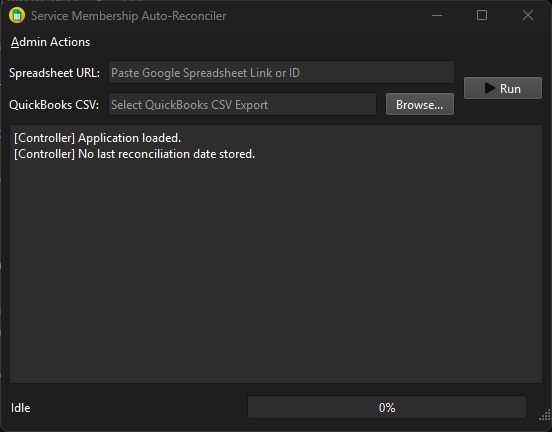

# Advanced Setup & Configuration

# This section is incomplete and will have further updates soon.

## Introduction

The CM Heating Service Account Reconciler is a desktop application designed to streamline the 
process of reconciling service account balances by integrating data from Google Sheets and 
QuickBooks. This guide will walk you through the setup and configuration process to get 
the application up and running.

!!! warning "Import Note" 
    The packaged release of this application, 
    [found here, on the releases page](https://github.com/AllegroVivo/CMServiceAccountReconciler/releases) 
    includes all necessary dependencies and files to run the application without additional setup. 
    This guide is primarily for users who wish to understand the configuration process or are setting 
    up the application from source.

## Preparation

Before beginning the setup process, ensure that you have downloaded the most recent source code 
and installed all dependencies by using the following command:

```bash
pip install -r requirements.txt
```

To build the application into a standalone executable, you will need to run the following 
`pyinstaller` command:

```bash
pyinstaller --clean -y --onefile --noconsole --icon=Assets/App.ico main.py
```

## Required Files

The application requires several key files in the same directory as the executable to function correctly.
These files include:

- `.env` - [Jump](#environment-file)
- `service_account.json`
- `service-reconciler.sqlite3`

### Environment File

The `.env` file is used to store environment variables and configuration settings for the application.
An example `.env` file is provided in the repository as `.env.example`. You should copy this file to 
`.env` and modify the settings as needed.

The expected structure of the `.env` file looks like this:

```env
DEV_DB_URL={DatabaseURL}
PROD_DB_URL={DatabaseURL}

# Disabling Debug mode causes the Production Database to be used
DEBUG=True
```

You will need to replace `{DatabaseURL}` with the appropriate SQLite or PostgreSQL database URL,
depending on your setup. A suggested SQLite URL for a simple local database is as follows:

```env
sqlite+pysqlite:///service-reconciler.sqlite3
```

### Service Account Credentials

The `service_account.json` file contains the credentials required for the application to access
the Google Sheets API. You will need to create a service account in the Google Cloud Console,
enable the Google Sheets API for your project, and download the JSON key file.

!!! Note
    It is not recommended that you try to manually create this file, therefore the contents are 
    not detailed here.

The Google-generated key file is not named "`service_account.json`", so rename it and ensure it is 
located in the same directory as the application executable.

### SQLite Database File [Optional] 

The `service-reconciler.sqlite3` file is the local database used by the application to store
intermediate data and configurations. If you are starting fresh, the application will create an 
empty SQLite database file with this name in the same directory as the application executable.

The database schema is as follows:


!!! Note
    If you are using a different database system (e.g., PostgreSQL), you do not need to create 
    this file, but you will need to ensure that the database URL in the `.env` file points to 
    your database instance.

## Initial Configuration

Once all required files are in place, you can launch the application by running the executable. 
Upon first launch, the application will read the appropriate database URL from the `.env` file
and prevision the requisite tables, if necessary.

Once the application has started, you will see the main interface.



If you don't have an existing `service-reconciler.sqlite3` file, or haven't run the Reconciler
previously, the application will create the necessary database schema automatically and the
log panel will indicate that no previous reconciliation date is stored (as seen above).

Before 