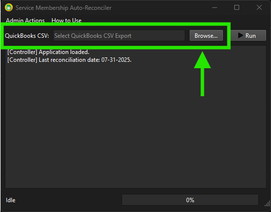

# Usage and Operation

## Introduction

The CM Heating Service Account Reconciler is a desktop application designed to streamline the 
accounting process of reconciling service account balances by integrating data from Google 
Sheets and QuickBooks. This guide will walk you through the usage and operation process to 
perform such a reconciliation.

!!! warning "Import Note" 
    The packaged release of this application, 
    [found here on the releases page,](https://github.com/AllegroVivo/CMServiceAccountReconciler/releases) 
    includes most all necessary dependencies and files to run the application without 
    additional setup.

    **The one exception is the `service_account.json` file, which must be provided by the end 
    user to allow access to the Google Sheets API.**

    If you don't have a `service_account.json` file, or are unsure how to obtain one, please
    refer to the [Setup and Configuration](setup.md) guide for more information.

## Starting the Application

To start the application, run the executable file. Upon launching, you will be presented
with the main interface.

The central log panel will display a startup message and echo the date of the most recent 
successful reconciliation. If this date is incorrect, you may need to adjust the last
reconciliation date in the database. Refer to the [Admin Features](admin-funcs.md#change-last-reconcile-date) guide for
instructions on how to do this.

!!! warning "Reconciliation Date"
    It should be noted that the application relies on the last reconciliation date to determine
    the names of the workbooks tabs to pull data from. If the date is incorrect, the application
    may attempt to access non-existent tabs, resulting in errors.

## Performing a Reconciliation

!!! Warning "Workbook Tabs"
    The application expects the Google Sheets workbook to contain tabs named in the format:

    `<Sheet Name> - MM-DD-YYYY`
    
    Whereas `<Sheet Name>` indicates the service account type (i.e. 
    Annual, Monthly, Duct Cleaning, etc...), and `MM-DD-YYYY` corresponds to the date of 
    the last reconciliation. Ensure that the tabs are correctly named to avoid errors during the
    reconciliation process!

    Please note it also expects a static tab named `Opening Balances`.

To perform a reconciliation, you'll need to begin by selecting the appropriate QuickBooks
Deferred Revenue export file. This should be a CSV file that has been exported from
QuickBooks and outlines the deferred revenue balances for service accounts for the relevant
period.

To select such a file, click the "Browse" button located next to the "QuickBooks CSV"
field. This will open a file dialog where you can navigate to and select the desired CSV file.

Once the file has been selected, its path will be displayed in the "QuickBooks CSV" field.
Next, click the "Run" button to initiate the reconciliation process.

Next, a date picker dialog will appear, prompting you to select the date of the
current reconciliation.

Select the appropriate date and click "OK" to proceed. The application will then begin
the reconciliation process, pulling data from the Google Sheets workbook and working in 
the QuickBooks data.

During the reconciliation, the log panel will display progress messages, indicating
the various steps being performed.

Upon completion, the log panel will indicate whether the reconciliation was successful
or if any errors were encountered. If successful, the application will update the last
reconciliation date in the database and the progress bar will display 100%. In the
event of a failure, the log panel will provide details on the encountered issues.
[Please contact the developer for assistance](mailto:stephanie@frogge.tech) if unexpected errors occur.

## Post-Reconciliation

After the reconciliation process is complete, there will be six new tabs added to the
Google Sheets workbook, five of which correspond to the various service account types - Annual,
Monthly, Plumbing, Generator, and Duct Cleaning - and one tab named Summary to display the accounting summary.
All of these tabs are post-fixed with the date of the reconciliation in the format `MM-DD-YYYY`.

Additionally, if any errors were encountered during the reconciliation, a "Parsing Errors" tab 
will also be generated and added to the workbook to help diagnose and resolve the issues, also
post-fixed with the reconciliation date.

To learn more about possible errors and how to address them, please refer to the
error handling and resolution section in the [Error Guide](errors.md).